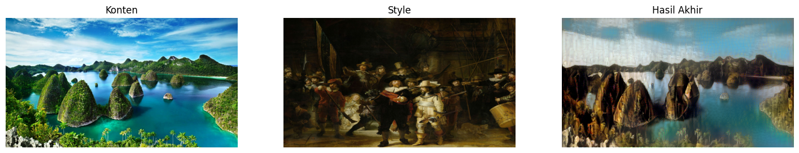

# 🎨 Neural Style Transfer (NST) with L-BFGS — VGG19

This repository contains an implementation of **Neural Style Transfer (NST)** using the **L-BFGS optimizer** and the pretrained **VGG19** convolutional neural network.

Tujuan dari proyek ini adalah **menggabungkan struktur gambar konten dengan gaya artistik dari gambar style**.

---

## 📌 Project Overview

NST bekerja dengan cara:

- Ekstraksi fitur **konten** dari gambar A (misalnya pemandangan Raja Ampat).
- Ekstraksi tekstur **gaya** dari gambar B (misalnya lukisan "The Night Watch").
- Mengoptimasi gambar baru sehingga:
  - Menjaga struktur konten
  - Mengambil pola, tekstur, dan warna dari style

Optimasi dilakukan menggunakan **L-BFGS**, yang cepat dan stabil.

---

## 🖼️ Input Images

| Konten (Raja Ampat) | Style (Penjaga Malam) |
|----------------------|------------------------|
|  |  |

---

## 🎯 Final Output

Hasil akhir penggabungan konten + style:



---

## ⚙️ How It Works

1. **Preprocessing gambar**
2. **Load VGG19 tanpa fully-connected**
3. **Hitung Content Loss**
4. **Hitung Style Loss dengan Gram Matrix**
5. **Hitung Total Loss**
6. **Optimasi dengan L-BFGS**
7. **Simpan dan tampilkan hasil**

---

## 🚀 How to Run

### 1. Clone Repository
```
git clone https://github.com/Arief-Saputra/Neural-Style-Transfer.git
cd Neural-Style-Transfer
```

### 2. Buka Notebook `.ipynb` di Colab

### 3. Ubah path gambar
```python
CONTENT_PATH = "/content/drive/.../content_raja_ampat.jpg"
STYLE_PATH   = "/content/drive/.../style_night_watch.jpg"
```

### 4. Jalankan semua sel

---

## 📁 Repository Structure

```
.
├── neural_style_transfer.ipynb
├── README.md
├── content_raja_ampat.jpg
├── style_night_watch.jpg
├── style_transfer_output.png
```

---

## 📚 Reference
- Gatys et al., *A Neural Algorithm of Artistic Style*, 2015  
- TensorFlow VGG19

---

## 📝 License
Released under MIT License.

